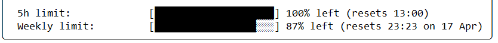
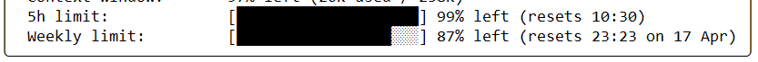

# Codex Session Primer

This Github action touches a coding session before your workday starts so the 5h rolling window begins earlier and Codex stays useful while you are actually trying to work.

## The Problem

Codex is great until the 5h limit is used up but you still have 3 hours of work left to do. 

Picture this:

1. You start work at 8:00.
2. You begin coding, and the 5h session window starts.
3. By 11:00 you have used all your tokens.
4. The coding machine is now unavailable until 13:00.
5. You now have to read documentation like a human!!.

## The Solution

This GitHub Action solves the misery by waking Codex up before you arrive.

1. The action runs at 5:30 and logs into Codex.
2. It makes a minimal request, using only a few tokens.
3. The 5h session window starts while you are still asleep or making breakfast at home.
4. You arrive at work at 8 AM and start working.
5. At 10:30 the session resets, just as ~~god~~ [Tibo](https://x.com/thsottiaux/status/2042067902392942790) intended.
6. You keep working until 15:30, when the next reset happens.


## Before / After - when you start work at 8AM

#### Before


#### After
(Look at the 5h reset time.) 



## How It Works

1. The workflow decrypts `auth.json.enc` into a runner-local `~/.codex`.
2. It runs a minimal prompt `codex exec ...` on GPT-5.4-mini low (currently the cheapest model in codex-cli).
3. If the ``auth.json`` is stale, Codex refreshes automatically.
4. The updated `auth.json` is encrypted back to `auth.json.enc`.
5. If the ciphertext changed, the workflow amends the latest commit and force-pushes with lease, so the next run of the action can login automatically as well.

This keeps the session reusable in CI without committing plaintext credentials. The Github action runs 5:30 AM by default, but you can change it [here](https://github.com/VIEWVIEWVIEW/codex-session-primer/blob/main/.github/workflows/codex-session-refresh.yml#L6).

>Please note that when scheduling a cron job an action on Github it is executed on "best effort" basis. Which means, that in some cases, cron jobs are executed with a delay up to 30 Minutes. Usually it's less, but it can happen. Manual runs are always executed instantly.

## Setup

1. Click on "Use this template".
2. Private the repo. Please.
3. Do not enable this workflow for fork PR execution. Ever.
4. Execute the bootstrap on a local, trusted machine and add the secret `AGE_PRIVATE_KEY` in GitHub (`Settings -> Secrets and variables -> Actions`).

### Bootstrap Once

On a trusted machine:

```bash
# Install tools
npm i -g @openai/codex

# Install age for key generation and encryption
sudo apt-get update
sudo apt-get install -y age git

# Install sops for encryption
curl -LO https://github.com/getsops/sops/releases/download/v3.12.2/sops-v3.12.2.linux.amd64
sudo mv sops-v3.12.2.linux.amd64 /usr/local/bin/sops
sudo chmod +x /usr/local/bin/sops

# Clone your repo
git clone https://github.com/$YOUR_USERNAME/codex-session-primer
cd codex-session-primer

# Create an isolated Codex home for config and auth.json
# This avoids messing with your real ~/.codex.
export CODEX_HOME="$(mktemp -d /tmp/codex-auth-seed.XXXXXX)"
cat > "$CODEX_HOME/config.toml" <<'EOF'
cli_auth_credentials_store = "file"
EOF

# Run browser login once
codex login
# On a remote or headless machine? Use `codex login --device-auth` instead.

# Generate age key pair fully in-memory
AGE_PRIVATE_KEY="$(age-keygen | awk '/^AGE-SECRET-KEY-1/{print $1}')"
AGE_PUBLIC_KEY="$(printf '%s\n' "$AGE_PRIVATE_KEY" | age-keygen -y)"

# Encrypt auth.json as binary payload and store it in the repo root
sops --encrypt --age "$AGE_PUBLIC_KEY" \
  --input-type binary --output-type binary \
  --output auth.json.enc "$CODEX_HOME/auth.json"

# Print the key and copy the printed line into GitHub Secret "AGE_PRIVATE_KEY"
# Settings -> Secrets and variables -> Actions
printf '%s\n' "$AGE_PRIVATE_KEY"
```

### Changing settings

You might want to take a look at ``.github/workflows/codex-session-refresh.yml``.

There you will find:

```yml
on:
  # The cron job start times (Github alkways uses UTC)
  schedule:
    - cron: "30 5 * * *"

jobs:
  refresh-auth:
    steps:
      - name: Prime session and refresh token if required
        # Change prompt and model which will execute it (low $/token model recommended).
        run: |
          set -euo pipefail
          export CODEX_HOME="$HOME/.codex"
          codex -m gpt-5.4-mini "Reply with exactly: SolidGoldMagikarp"

```

### Commit

Commit only the encrypted auth file and the Github action (if you made any changes to the settings, such as changing the model or execution times).

```bash
git add auth.json.enc .github/workflows/codex-session-refresh.yml
git commit -m "Add encrypted Codex auth refresh workflow"
git push


# Important!
# Exit the shell, so you don't accidentally run codex from the TMP directory.
# If you do, the secret in the home might rotate, and the one in the repo stops working.
exit
```
You can now run the action manually once, to check if it works. It will always run according to your cronjob.

Done! Have a productive day!

>Do not run the action multiple times at once. It could cause a race condition and create a stale ``auth.json``, which means you would have to create and export an auth token from your local PC once more.

## Is this allowed?

I don't know! But it's not much different from using Codex in a random CI/CD job which gets triggered at a specific time of day. If it isn't allowed, please let me know by opening an issue. I will archive the repo and stop using it personally.

Please don't abuse it, and only use it if you're financially struggling (like me, hah!). Thank you, and thanks to OpenAI for your awesome service! Love you all.
